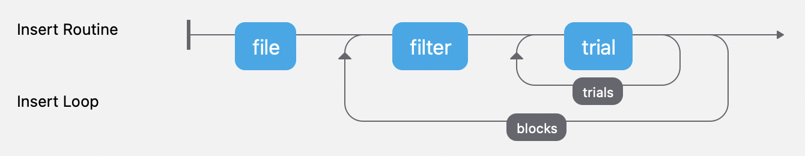

# crowding

A PsychoPy (soon PsychoJS) implementation of crowding threshold measurement experiment.



## Example CSV File

```
blockOrder,1,1,2,2
conditionName,crowding,crowding,crowding,crowding
conditionTrials,40,40,40,40
fixationStrokeLengthDeg,1,1,1,1
fixationStrokeThicknessDeg,0.03,0.03,0.03,0.03
fixationYes,TRUE,TRUE,TRUE,TRUE
showAlphabetWhere,bottom,bottom,bottom,bottom
showCounterWhere,bottomRight,bottomRight,bottomRight,none
showInstructionsWhere,topLeft,topLeft,topLeft,none
simulateParticipantYes,FALSE,FALSE,FALSE,FALSE
simulationModel,blind,blind,blind,ideal
spacingDirection,radial,radial,radial,radial
spacingOverSizeRatio,1.4,1.4,1.4,1.4
targetAlphabet,DHKNORSVZ,DHKNORSVZ,acenorsuvxz,acenorsuvxz
targetDurationSec,0.15,0.15,0.15,0.15
targetEccentricityXDeg,10,-10,10,-10
targetEccentricityYDeg,0,0,0,0
targetFont,Sloan,Sloan,Verdana,Verdana
targetFontStyle,,,,
targetKind,letter,letter,letter,letter
targetMinimumPix,8,8,8,8
targetTask,identify,identify,identify,identify
thresholdBeta,2.3,2.3,2.3,2.3
thresholdDelta,0.01,0.01,0.01,0.01
thresholdGuess,2,2,2,2
thresholdGuessLogSd,3,3,3,3
thresholdParameter,spacing,spacing,spacing,spacing
thresholdProbability,0.7,0.7,0.7,0.7
trackGazeYes,TRUE,TRUE,TRUE,TRUE
trackHeadYes,TRUE,TRUE,TRUE,TRUE
viewingDistanceDesiredCm,40,40,40,40
wirelessKeyboardNeededYes,FALSE,FALSE,FALSE,FALSE
```

A **CSV file** named `experiment.csv` must be placed at the same directory as the PsychoPy file. The program will take care of the rest. We use a transposed CSV as the input file so that it's easier to read and edit. The program is designed to handle this transposed style and will help you transpose back for PsychoPy to use.

🚨 Things worth noting:

1. Due to a PsychoPy limitation, `conditionTrials` must be the same for each condition within one block.

## PsychoPy Version

`2021.3.0`.

## TODO

- [ ] Check parameter spelling and give fatal error when detect any.

Working parameters:

```
x   blockOrder
    conditionName
x   conditionTrials
    fixationStrokeLengthDeg
    fixationStrokeThicknessDeg
x   fixationYes
    showAlphabetWhere
    showCounterWhere
    showInstructionsWhere
    simulateParticipantYes
    simulationModel
x   spacingDirection
x   spacingOverSizeRatio
!   targetAlphabet => (Allowed keys) not supported when export to JS
x   targetDurationSec
x   targetEccentricityXDeg
x   targetEccentricityYDeg
x   targetFont
    targetFontStyle
    targetKind
x   targetMinimumPix
    targetTask
x   thresholdBeta
x   thresholdDelta
x   thresholdGuess
x   thresholdGuessLogSd
    thresholdParameter
x   thresholdProbability
    trackGazeYes
    trackHeadYes
x   viewingDistanceDesiredCm
    wirelessKeyboardNeededYes
```

`x` means working.
