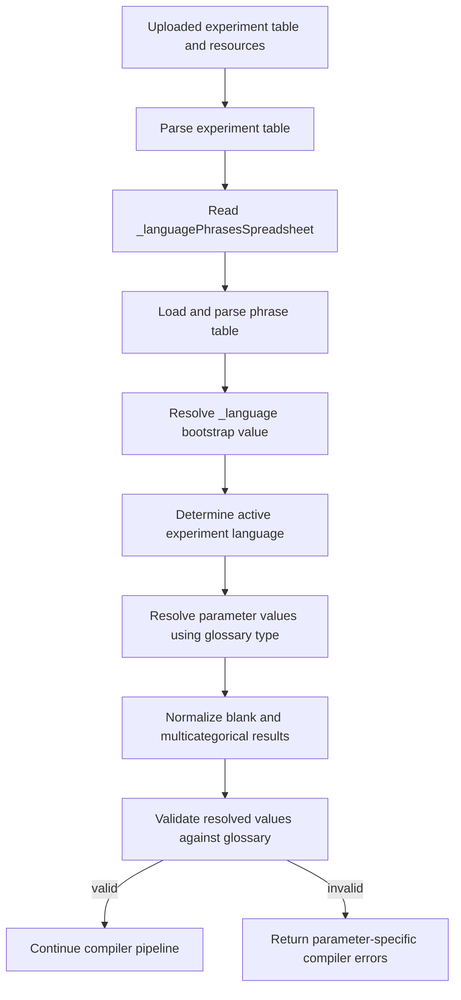
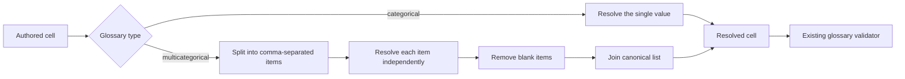
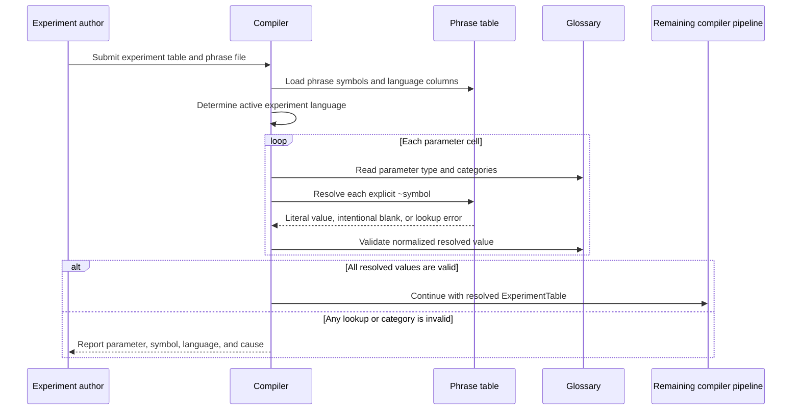

# Language-aware categorical parameters

## Purpose

Allow an experiment author to select categorical parameter values by language without weakening glossary validation. The feature applies uniformly to glossary parameters of type `categorical` and `multicategorical`.

This document uses Specification by Example: concrete examples define the expected behavior and expose boundary cases before implementation.

## Rules

1. A literal category is used unchanged.
2. A phrase reference is an item whose trimmed value starts with `~`.
3. Phrase symbols are matched case-insensitively, consistent with current phrase lookup.
4. A phrase reference is resolved using the active experiment language.
5. A categorical cell contains one literal category or one phrase reference.
6. A multicategorical cell contains comma-separated literal categories, phrase references, or both.
7. An existing phrase cell may intentionally be blank.
8. A blank categorical result uses the parameter's existing empty/default behavior.
9. A blank item in a multicategorical result is removed from the list.
10. Empty items caused by repeated or trailing commas are removed.
11. The resolved value is validated against the parameter's glossary categories.
12. A missing phrase symbol, missing language column, or invalid resolved category is a compiler error.
13. An unmarked invalid category is never used as an implicit phrase symbol.
14. `_languagePhrasesSpreadsheet` and `_language` are resolved during bootstrap and are outside the general categorical pass.

## Architecture and integration

The compiler already loads the phrase table, determines the active language, resolves tilde values, and validates the resulting experiment table. The change introduces a glossary-aware resolution policy between language bootstrap and validation.

The resolver receives:

- the raw `ExperimentTable`;
- the parsed phrase table;
- the active experiment language; and
- glossary metadata for each parameter.

For parameters that are not categorical, existing phrase-resolution behavior remains unchanged. For `categorical` and `multicategorical` parameters, the resolver uses the policies in this specification.



### Resolution boundary

Phrase resolution transforms authored values into language-specific authored values. It does not decide whether a category is legal. Glossary validation owns that decision.



### One compiler run



## Illustrative phrase table

| symbol                   | en              | ar         | ur         | fa         |
| ------------------------ | --------------- | ---------- | ---------- | ---------- |
| `EnglishIsWrongLanguage` | `wrongLanguage` |            |            |            |
| `LanguageDirection`      | `LTR`           | `RTL`      | `RTL`      | `RTL`      |
| `InvalidDirection`       | `sideways`      | `sideways` | `sideways` | `sideways` |

An empty cell in an existing language column is an intentional blank. An absent language column is a missing translation.

## Key examples

### Example 1: phrase-only multicategorical value

Given `fontTolerateFaults` is `multicategorical` and allows `wrongLanguage`, `missingCharacters`, `badGSUB`, `badGPOS`, and `all`:

| Authored value            | Active language | Resolved value  | Result                         |
| ------------------------- | --------------- | --------------- | ------------------------------ |
| `~EnglishIsWrongLanguage` | `en`            | `wrongLanguage` | Valid                          |
| `~EnglishIsWrongLanguage` | `ar`            | empty           | Valid; tolerate no font faults |
| `~EnglishIsWrongLanguage` | `ur`            | empty           | Valid; tolerate no font faults |
| `~EnglishIsWrongLanguage` | `fa`            | empty           | Valid; tolerate no font faults |

### Example 2: combined multicategorical value

| Authored value                                | Active language | Resolved items                              | Final value                        |
| --------------------------------------------- | --------------- | ------------------------------------------- | ---------------------------------- |
| `missingCharacters, ~EnglishIsWrongLanguage,` | `en`            | `missingCharacters`, `wrongLanguage`, empty | `missingCharacters, wrongLanguage` |
| `missingCharacters, ~EnglishIsWrongLanguage,` | `ar`            | `missingCharacters`, empty, empty           | `missingCharacters`                |
| `missingCharacters, ~EnglishIsWrongLanguage,` | `ur`            | `missingCharacters`, empty, empty           | `missingCharacters`                |
| `missingCharacters, ~EnglishIsWrongLanguage,` | `fa`            | `missingCharacters`, empty, empty           | `missingCharacters`                |

### Example 3: categorical value

Given `fontDirection` is categorical and allows `LTR` and `RTL`:

| Authored value       | Active language | Resolved value | Result |
| -------------------- | --------------- | -------------- | ------ |
| `~LanguageDirection` | `en`            | `LTR`          | Valid  |
| `~LanguageDirection` | `ar`            | `RTL`          | Valid  |
| `~LanguageDirection` | `ur`            | `RTL`          | Valid  |
| `~LanguageDirection` | `fa`            | `RTL`          | Valid  |

## Specification scenarios

### Scenario: resolve a phrase-only value to a legal category

```gherkin
Given fontTolerateFaults is a multicategorical parameter
And EnglishIsWrongLanguage is "wrongLanguage" for language "en"
When fontTolerateFaults is "~EnglishIsWrongLanguage"
And the active experiment language is "en"
Then fontTolerateFaults resolves to "wrongLanguage"
And compilation reports no category error for fontTolerateFaults
```

### Scenario: accept an intentional blank

```gherkin
Given fontTolerateFaults has an empty default
And EnglishIsWrongLanguage has an existing blank cell for language "ur"
When fontTolerateFaults is "~EnglishIsWrongLanguage"
And the active experiment language is "ur"
Then fontTolerateFaults resolves to an empty value
And no font fault is tolerated by that value
And compilation reports no phrase-resolution error
```

### Scenario: combine a literal category with a phrase reference

```gherkin
Given missingCharacters and wrongLanguage are legal fontTolerateFaults categories
And EnglishIsWrongLanguage is "wrongLanguage" for language "en"
When fontTolerateFaults is "missingCharacters, ~EnglishIsWrongLanguage,"
And the active experiment language is "en"
Then fontTolerateFaults resolves to "missingCharacters, wrongLanguage"
And both missingCharacters and wrongLanguage faults are tolerated
```

### Scenario: remove a blank item from a combined value

```gherkin
Given missingCharacters is a legal fontTolerateFaults category
And EnglishIsWrongLanguage has an existing blank cell for language "fa"
When fontTolerateFaults is "missingCharacters, ~EnglishIsWrongLanguage,"
And the active experiment language is "fa"
Then fontTolerateFaults resolves to "missingCharacters"
And only the missingCharacters fault is tolerated
```

### Scenario: reject a missing phrase symbol

```gherkin
Given the phrase table does not contain EnglishIsWrongLanguage
When fontTolerateFaults is "~EnglishIsWrongLanguage"
Then compilation reports that the phrase symbol was not found
And compilation does not treat the value as an empty category
```

### Scenario: distinguish a missing language column from an intentional blank

```gherkin
Given the phrase table contains EnglishIsWrongLanguage
But the phrase table has no "ur" language column
When fontTolerateFaults is "~EnglishIsWrongLanguage"
And the active experiment language is "ur"
Then compilation reports that language "ur" is missing from the phrase table
```

### Scenario: reject an invalid resolved category

```gherkin
Given fontDirection allows only "LTR" and "RTL"
And InvalidDirection is "sideways" for language "en"
When fontDirection is "~InvalidDirection"
And the active experiment language is "en"
Then fontDirection resolves to "sideways"
And glossary validation reports "sideways" as an invalid fontDirection category
```

### Scenario: preserve typo detection

```gherkin
Given wrongLanguage is a legal fontTolerateFaults category
When fontTolerateFaults is "wrongLangauge"
Then compilation reports "wrongLangauge" as an invalid category
And the compiler does not look up a phrase named wrongLangauge
```

### Scenario: preserve a literal categorical value

```gherkin
Given RTL is a legal fontDirection category
When fontDirection is "RTL"
Then fontDirection remains "RTL"
And the phrase table is not consulted for that value
```

## Error behavior

| Condition                                             | Compiler behavior                                                         |
| ----------------------------------------------------- | ------------------------------------------------------------------------- |
| No phrase table is configured but a `~symbol` is used | Report that a phrase table is required                                    |
| Phrase symbol is absent                               | Report the parameter and missing symbol                                   |
| Active language column is absent                      | Report the parameter, symbol, and language                                |
| Phrase cell exists and is blank                       | Accept it and apply empty/default normalization                           |
| Resolved value is not a glossary category             | Report the resolved invalid category through existing glossary validation |
| Literal value is not a glossary category              | Report it as an invalid category; do not perform implicit lookup          |

## Acceptance criteria

- The key examples produce exactly the documented resolved values.
- The behavior is shared by all `categorical` and `multicategorical` glossary parameters.
- Existing literal categorical values behave unchanged.
- Missing symbols and missing language columns remain compiler errors.
- Intentional blanks are not reported as missing translations.
- Multicategorical values can combine literals and phrase references.
- Category typos remain visible and are never interpreted implicitly.
- The normalized table is the single input to all later validators and compiler stages.
